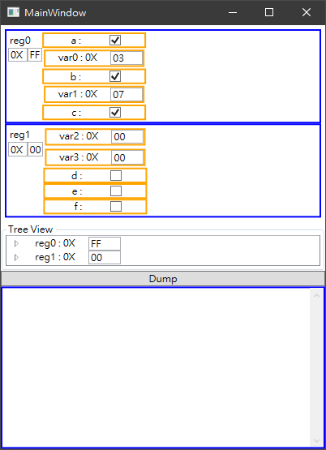

# General MCU register data structure Test



## Usage

- Add Converters to Project Reference
- Add Register Database

```
RegList.Add(new()
{
    //DebugPrint = DebugPrint,
    Name = "reg0",
    Items = new()
    {
        new FlagClass(){Name= "a", Pos = 0} ,
        new VarClass() {Name= "var0", Mask = 0x03, Pos = 1, Value = 0} ,
        new FlagClass(){Name= "b",Pos = 3},
        new VarClass() {Name= "var1", Mask = 0x07, Pos = 4 , Value = 0},
        new FlagClass() {Name= "c", Pos = 7},
    },
    Value = 0xFF
});
```

- Assign register list to ItemsSource in ViewModel
```
<TreeView ItemsSource="{Binding RegList}" x:Name="TreeviewContainer">
```

- Add the following to Xaml
```
<Window ...
        ...
        xmlns:uc="clr-namespace:UserControls"      
        ...>
<Grid>
...
...
<uc:McuRegUserControl></uc:McuRegUserControl>
...
...
</Grid>

</Window>
``` 

- Add Dictionary File `ConvertersDictionary.xaml` for Value Converter

```
<ResourceDictionary xmlns="http://schemas.microsoft.com/winfx/2006/xaml/presentation"
                    xmlns:converters="clr-namespace:Converters;assembly=Converters"
                    xmlns:x="http://schemas.microsoft.com/winfx/2006/xaml">
    <converters:NumberToHexString x:Key="NumberToHexString"/>
    <converters:ItemToVisibilityConverter x:Key="ItemToVisibilityConverter"/>
    <converters:ItemToBoolConverter x:Key="ItemToBoolConverter"/>
</ResourceDictionary>
```

- Add dictionary to App.xaml

```
<Application x:Class="test_register_wpf.App"
             xmlns="http://schemas.microsoft.com/winfx/2006/xaml/presentation"
             xmlns:x="http://schemas.microsoft.com/winfx/2006/xaml"
             xmlns:local="clr-namespace:test_register_wpf"                     
             StartupUri="MainWindow.xaml">
    <Application.Resources>
        <ResourceDictionary>
            <ResourceDictionary.MergedDictionaries>
                <!-- MahApps.Metro resource dictionaries. Make sure that all file names are Case Sensitive! -->
                <!-- My Dictionaries -->
                <!-- https://yuchungchuang.wordpress.com/2019/05/01/wpf-resources/ -->
                <ResourceDictionary Source="Dictionary/ConvertersDictionary.xaml" />
            </ResourceDictionary.MergedDictionaries>
        </ResourceDictionary>
    </Application.Resources>
</Application>

```